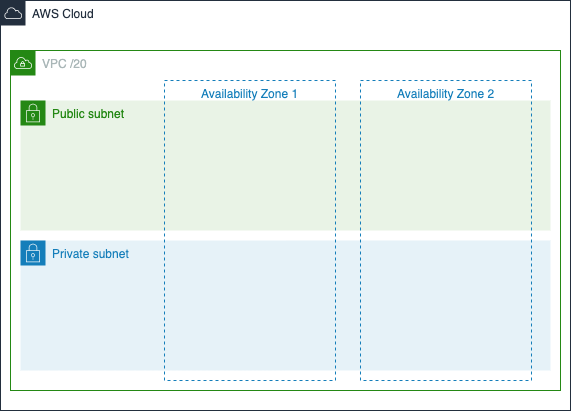

# VPC scenario 

## Background
The head of cloud has asked you to design the new configuration of code for VPCs in the organisation

You will need to submit a method of being able to repeatedly deploy a VPC. 

### VPC requirements

The VPC must...

* take in a /20 ip range
* have a default DHCP options set
* be highly available - with 2 AZs
* have a private and public subnets 
* accept http and https traffic from the open internet
* the private subnet should be able to route out to the internet for package and patch updates
* the private subnet must only support RDS MySQL ports and web ports (http and https)
* private a clear method of application to be able to find what subnets to use

Additionally the VPC must be future proof to support
* integration with other VPCs 
* talk securely and privately to S3
* talk security and privately to an ECR repo 

